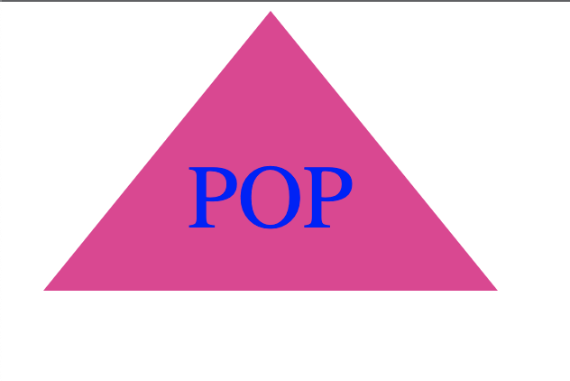

# SVG Logo Maker
## Description
The purpose of this application is to generate a simple logo SVG file based off of user input. There are 3 shape options, circle, square, and triangle. It allows for a maximum 3 characters of text as well so You can include your company's abbreviation or title. This program utilizes node.js, inquirer, and jest. This is for the prompt system (inquirer) and for the testing system (jest).
## Installation
To run this application you will need to first clone the code from this repository, then navigate to the correct directory, and finally run `npm install` in your terminal.
## Usage
Once the npm package has been installed, type `node index.js` in the terminal and you will be presented with a series of prompts which will then lead to your generated SVG Logo.

[Click here](./images/walkthrough.mp4) for a video walkthrough.
### Resources
[Github Repo](https://github.com/cdgonzo23)

### Example Screenshots

